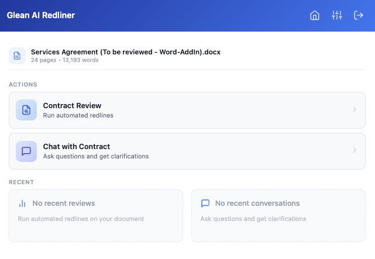
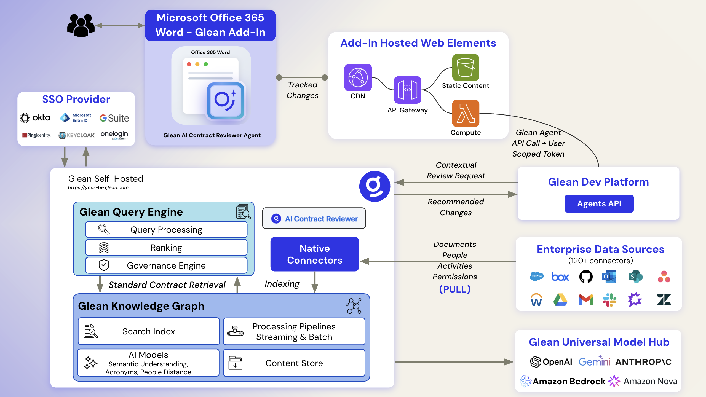
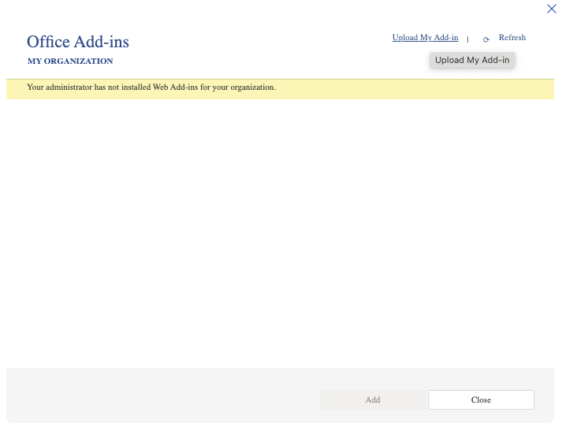
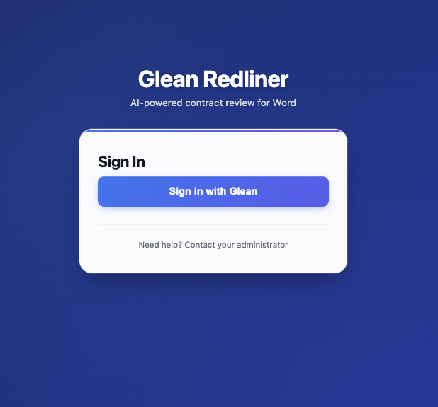
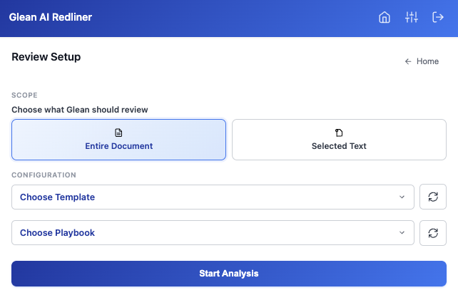
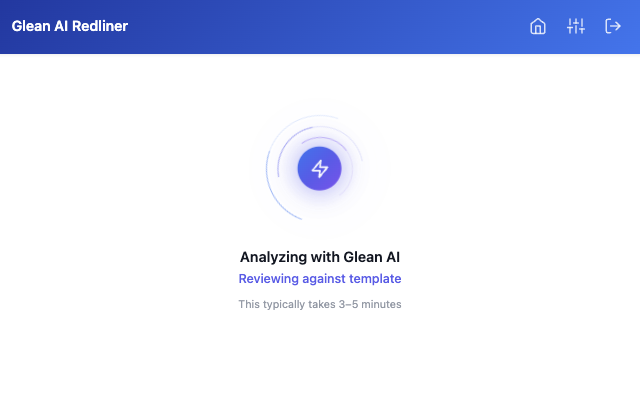

# Glean Legal Redlining for Word

AI-powered contract review and redlining for Microsoft Word, backed by Glean Agents and deployable on AWS.



## Overview

Glean Legal Redlining for Word brings contract review into Microsoft Word. Users can review a full document or a selected excerpt against templates and playbooks, receive structured redline recommendations, ask document-grounded questions, and apply accepted recommendations with Word Track Changes.

The recommended production deployment uses **Glean SSO with OAuth2 PKCE and Dynamic Client Registration (DCR)**. In this mode, users click **Sign in with Glean** and authenticate through their organization's Glean login. Users do **not** need to paste a personal Glean API token.

This repository is a customer-deployable example. AI-generated redline suggestions are review assistance only and must be reviewed by qualified users before they are applied to legal documents. This example is not legal advice.

## Key Features

- **Playbook Review**: Analyze a full document or selected text against configurable templates and playbooks.
- **AI Redline Recommendations**: Receive structured replace, insert, delete, and missing-clause recommendations.
- **Track Changes Application**: Apply selected recommendations back into Word using native Track Changes.
- **Chat With Contract**: Ask questions grounded in the current document text.
- **Template and Playbook Picker**: Retrieve available templates and playbooks through a Glean Listing Agent.
- **Admin Defaults**: Manage organization-wide defaults, agent IDs, and admin users through DynamoDB-backed configuration.
- **AWS Deployment**: Host the Office Add-in and API proxy layer on AWS serverless infrastructure.

## Recommended Production Setup

For customer deployments, use:

- Microsoft Word Add-in hosted from S3 and CloudFront.
- API Gateway + Lambda proxy endpoints for Glean agent, chat, OAuth, and config calls.
- Glean OAuth SSO with `AUTH_MODE=sso`.
- Dynamic Client Registration with `OAUTH_CLIENT_TYPE=dcr`.
- Three Glean Agents:
  - Redliner Agent
  - Chat Agent
  - Template & Playbook Listing Agent
- No per-user Glean API token.

Optional Cognito username/password authentication remains supported for demos, POCs, or isolated test environments. In Cognito mode only, users must provide a Glean API token with the required permissions.

## Architecture



```text
Microsoft Word Add-in
    ↓
CloudFront + S3 static hosting
    ↓
API Gateway
    ↓
Lambda proxy functions
├── /list    → Glean Template & Playbook Listing Agent
├── /analyze → Glean Contract Redlining Agent
├── /chat    → Glean Chat API
├── /config  → DynamoDB-backed org config
└── /oauth   → Glean OAuth token / DCR helper endpoints
    ↓
Glean Platform
```

### Components

- **Frontend**: Office.js taskpane app using vanilla JavaScript, HTML, and CSS.
- **Authentication**: Recommended Glean OAuth SSO (PKCE + DCR); optional Cognito mode for demos/POCs.
- **Backend**: AWS Lambda functions behind API Gateway.
- **Hosting**: S3 private bucket served through CloudFront.
- **Configuration**: DynamoDB config table for org defaults and admin-managed settings.
- **Security**: CloudFront, WAF, private S3 bucket with OAC, HTTPS, PKCE, OAuth state validation, and optional Cognito resources.
- **Glean**: Agents API, Chat API, and OAuth endpoints.

## Prerequisites

Before deploying, have the following ready:

- AWS account with permission to deploy CloudFormation, Lambda, API Gateway, CloudFront, S3, DynamoDB, IAM, WAF, and ACM resources.
- AWS CLI configured with a deployer profile.
- A custom domain you control.
- ACM certificate for the domain in `us-east-1` (required by CloudFront custom domains).
- Glean instance with access to create and configure agents.
- Microsoft 365 tenant or Word environment where you can centrally deploy or sideload a custom Word Add-in.
- Bash or zsh shell.
- Node.js 16+ for local Office Add-in development tooling only.

## Quick Start

1. Create the three Glean Agents from `deployment/glean/agents/`.
2. Copy `deployment/config/prod.env.example` to `deployment/config/prod.env`.
3. Configure `prod.env` for AWS, domain, Glean instance, admin emails, and agent IDs.
4. Use `AUTH_MODE=sso` and `OAUTH_CLIENT_TYPE=dcr` for the recommended production setup.
5. Deploy infrastructure:

   ```bash
   ./deployment/scripts/deploy-infrastructure.sh prod
   ```

6. Create the DNS CNAME from your custom domain to the CloudFront distribution.
7. Deploy app files and generated config:

   ```bash
   ./deployment/scripts/deploy-app.sh prod
   ```

8. Install the generated `manifest.xml` in Microsoft Word through centralized deployment or sideloading.
9. Open the add-in, click **Sign in with Glean**, and test template listing, redlining, chat, and Track Changes.

Estimated setup time from the original deployment guide is about 45 minutes, excluding any customer-specific security review or DNS propagation delays.

## Step 1: Set Up Glean Agents

Create three agents in your Glean instance using the templates and instructions in `deployment/glean/agents/`.

### 1.1 Chat Agent

1. Log into your Glean instance.
2. Navigate to **Agents** and create a new agent.
3. Use `deployment/glean/agents/chat-agent-template.json` or `deployment/glean/agents/chat-automode-instruction.md`.
4. Configure it as a legal Q&A assistant grounded in contract text.
5. Copy the Agent ID for `CHAT_AGENT_ID`.

### 1.2 Redliner Agent

1. Create a new agent in Glean.
2. Use `deployment/glean/agents/redliner-agent-template.json` or the latest versioned instruction file (`redliner-automode-instruction-v4.md`).
3. Configure the agent to return XML changes with supported change types (`replace`, `insert`, `delete`, `insertClause`).
4. Test with a representative contract, template, and playbook.
5. Copy the Agent ID for `REDLINER_AGENT_ID`.

### 1.3 Template & Playbook Listing Agent

1. Create a new agent in Glean.
2. Use `deployment/glean/agents/listing-agent-template.json` or `deployment/glean/agents/listing-automode-instruction.md`.
3. Configure the template and playbook source folders.
4. Ensure the agent has access to read the relevant document source.
5. Copy the Agent ID for `LISTING_AGENT_ID`.

## Step 2: Create AWS Certificate

CloudFront requires custom-domain ACM certificates in `us-east-1`.

1. Open AWS Certificate Manager in `us-east-1`.
2. Request a public certificate for your add-in domain, for example `redlining.example.com`.
3. Complete DNS or email validation.
4. Copy the certificate ARN for `CERTIFICATE_ARN`.

## Step 3: Configure `prod.env`

Create your environment file:

```bash
cp deployment/config/prod.env.example deployment/config/prod.env
```

For production SSO/DCR, configure:

```bash
# AWS Configuration
AWS_PROFILE=your-aws-profile-name
AWS_REGION=us-east-1

# CloudFormation Stack
STACK_NAME=glean-legal-addin
DEPLOYMENT_ID=prod

# Domain and Certificate
DOMAIN_NAME=redlining.example.com
CERTIFICATE_ARN=arn:aws:acm:us-east-1:ACCOUNT_ID:certificate/CERTIFICATE_ID

# Recommended production authentication
AUTH_MODE=sso
OAUTH_CLIENT_TYPE=dcr

# DCR mode does not require a static OAuth client ID or secret.
GLEAN_OAUTH_CLIENT_ID=
GLEAN_OAUTH_CLIENT_SECRET=

# Admin Configuration
ADMIN_EMAILS=admin@example.com

# Glean Configuration
GLEAN_INSTANCE=your-instance-name
CHAT_AGENT_ID=your-chat-agent-id
REDLINER_AGENT_ID=your-redliner-agent-id
LISTING_AGENT_ID=your-listing-agent-id
```

### Authentication Modes

#### Recommended: Glean SSO with DCR

Use this for production deployments:

```bash
AUTH_MODE=sso
OAUTH_CLIENT_TYPE=dcr
GLEAN_OAUTH_CLIENT_ID=
GLEAN_OAUTH_CLIENT_SECRET=
```

In this mode:

- Users click **Sign in with Glean**.
- The add-in uses OAuth2 PKCE.
- The first login registers a public OAuth client through the DCR Lambda if one is not already cached.
- The OAuth access token is used for Glean Agents and Chat calls.
- Users do not enter a Glean API token.

#### Optional: SSO with Static OAuth Client

Use this only if your environment requires a pre-registered OAuth client:

```bash
AUTH_MODE=sso
OAUTH_CLIENT_TYPE=static
GLEAN_OAUTH_CLIENT_ID=your-client-id
GLEAN_OAUTH_CLIENT_SECRET=your-client-secret
```

Register the client in Glean Admin Console with redirect URI:

```text
https://<your-domain>/taskpane/oauth-callback.html
```

Requested scopes:

```text
agents chat search
```

#### Optional: Cognito Demo/POC Mode

Cognito mode remains available for demos, POCs, and isolated testing:

```bash
AUTH_MODE=cognito
COGNITO_USER_EMAIL=admin@example.com
COGNITO_USER_PASSWORD=<your-strong-password>
```

In Cognito mode, users sign in with Cognito credentials and must provide a Glean API token in the add-in settings. The API token must have access to the required Glean capabilities, including agents and chat.

## Step 4: Deploy AWS Infrastructure

From the project root:

```bash
./deployment/scripts/deploy-infrastructure.sh prod
```

The script loads `deployment/config/prod.env`, then creates or updates the CloudFormation stack.

Infrastructure includes:

- S3 bucket for private static hosting.
- CloudFront distribution and Origin Access Control.
- Lambda@Edge request handler.
- WAF rules and rate limiting.
- API Gateway REST API.
- Lambda proxy functions for listing, analysis, chat, config, OAuth token exchange, and DCR registration.
- DynamoDB config table.
- Cognito resources only when `AUTH_MODE=cognito`.

The infrastructure deployment can take 10-15 minutes.

## Step 5: Configure DNS

Create a CNAME record in your DNS provider:

- **Name**: your add-in subdomain, for example `redlining.example.com`
- **Value**: the CloudFront distribution domain printed by the infrastructure deployment
- **TTL**: 300 seconds or your organization's standard value

Wait for DNS propagation before installing the manifest through Microsoft 365.

## Step 6: Deploy Application Files

From the project root:

```bash
./deployment/scripts/deploy-app.sh prod
```

This script:

- Generates `src/config/api.js` from CloudFormation outputs.
- Generates `src/taskpane/login.js` and `src/taskpane/auth.js`.
- Generates `src/config/glean-defaults.js` with auth mode, OAuth client type, Glean instance, and agent IDs.
- Generates `manifest.xml` from `manifest.xml.example`.
- Seeds or syncs DynamoDB org configuration.
- Syncs app files from `src/` to S3.
- Uploads `manifest.xml` to the S3 root.
- Creates a CloudFront invalidation.

The app deploy usually takes 2-3 minutes.

## Step 7: Install in Microsoft Word

There are two installation paths.

### Option A: Centralized Deployment (Recommended)

Use Microsoft 365 Admin Center:

1. Sign in to `admin.microsoft.com` as a Microsoft 365 admin.
2. Navigate to **Settings** → **Integrated apps**.
3. Choose **Upload custom apps**.
4. Select **Provide a URL to the manifest file**.
5. Enter:

   ```text
   https://<your-domain>/manifest.xml
   ```

6. Assign users or security groups.
7. Deploy.

The manifest URL is stable. Future `deploy-app.sh` runs update the hosted manifest without requiring IT to upload a new file.

### Option B: Manual Sideloading (Development/Test)

1. Open Microsoft Word.
2. Go to **Insert** → **Get Add-ins**.
3. Open **My Add-ins**.
4. Choose **Upload My Add-in**.
5. Upload the generated `manifest.xml`.



## Step 8: Test the Add-in

1. Open the add-in from the Word ribbon.
2. In SSO mode, click **Sign in with Glean**.
3. Complete your organization's Glean login.
4. Confirm the home screen loads.
5. Open **Redlining Review**, select a template and playbook, and run analysis.
6. Apply a small set of recommendations and confirm Word Track Changes are created.
7. Open **Chat with Contract** and ask a document-grounded question.







## Admin Configuration

The add-in includes an admin configuration flow for organization-wide defaults. Admin users are seeded through `ADMIN_EMAILS` in `prod.env` and can manage supported settings after deployment.

Admin-managed settings include:

- Glean instance name.
- Chat, Redliner, and Listing Agent IDs.
- OAuth client ID for static OAuth mode.
- Admin email list.
- Default template and playbook settings.
- Track Changes and notification defaults.

Settings are resolved in this order:

1. User override from local settings.
2. Org config from DynamoDB/admin page.
3. Baked-in defaults generated from `prod.env`.

## Local Development

This project deploys source files directly to S3. There is no production webpack build step.

```bash
npm install
npm run dev-certs
npm run validate
npm run sideload
```

Generated deployment files are gitignored:

- `src/config/api.js`
- `src/config/glean-defaults.js`
- `src/taskpane/login.js`
- `src/taskpane/auth.js`
- `manifest.xml`

## Updating a Deployment

### Frontend or Agent Setting Changes

Use this after changing files under `src/` or refreshing generated defaults:

```bash
./deployment/scripts/deploy-app.sh prod
```

### Infrastructure Changes

Use this after changing `deployment/cloudformation.yaml`:

```bash
./deployment/scripts/deploy-infrastructure.sh prod
./deployment/scripts/deploy-app.sh prod
```

### Force-Reseed Org Config

If you need to overwrite DynamoDB defaults from `prod.env`:

```bash
./deployment/scripts/deploy-app.sh prod --force-seed
```

## Team Handoff

The real `deployment/config/prod.env` file is gitignored. A new deployer should:

1. Copy the example:

   ```bash
   cp deployment/config/prod.env.example deployment/config/prod.env
   ```

2. Fill in AWS, domain, certificate, auth mode, admin emails, Glean instance, and agent IDs.
3. Use SSO/DCR unless there is a specific reason to use Cognito or static OAuth.
4. Run the infrastructure and app deployment scripts.

## Troubleshooting

### Add-in Does Not Load

- Verify `manifest.xml` URLs use the expected custom domain.
- Confirm the CloudFront distribution is deployed.
- Confirm DNS points to CloudFront.
- Check the browser/Office.js console.

### Sign in with Glean Does Not Work

- Confirm `AUTH_MODE=sso` in `prod.env` and in generated `src/config/glean-defaults.js`.
- Confirm `OAUTH_CLIENT_TYPE=dcr` unless you intentionally use a static OAuth client.
- Confirm `https://<your-domain>/taskpane/oauth-callback.html` is reachable.
- Check browser console logs for `[OAUTH]` messages.
- Check the DCR registration Lambda and OAuth token proxy Lambda logs in CloudWatch.

### Agent Calls Fail

- Confirm `GLEAN_INSTANCE` is correct.
- Confirm the Redliner, Chat, and Listing Agent IDs are correct.
- Confirm the user has signed in through Glean SSO and has a valid OAuth access token.
- In Cognito mode only, confirm the user's Glean API token is configured and has the required permissions.
- Review Lambda logs for `/list`, `/analyze`, or `/chat`.

### Template or Playbook Lists Are Empty

- Confirm the Listing Agent is configured with the correct source folders.
- Confirm the agent has access to the underlying documents.
- Confirm the Listing Agent returns valid JSON.

### Changes Do Not Apply

- Confirm Word Track Changes can be enabled.
- Check browser console logs for search or XML parsing errors.
- Confirm the Redliner Agent returns valid XML matching the expected change schema.

### CloudFormation Deployment Fails

- Confirm you are deploying in the intended AWS region.
- Confirm the ACM certificate exists in `us-east-1`.
- Confirm the AWS CLI profile has sufficient permissions.
- Review CloudFormation stack events.

## Optional: Cognito Mode

Cognito mode is still supported, but it is not the recommended production path for Solutions Library deployments.

Use Cognito mode when:

- You need a quick isolated demo environment.
- You do not want to wire SSO during a POC.
- You are testing infrastructure without involving an enterprise IdP.

In Cognito mode:

- Set `AUTH_MODE=cognito`.
- Provide `COGNITO_USER_EMAIL` and `COGNITO_USER_PASSWORD`.
- Users sign in with Cognito credentials.
- Each user must configure a Glean API token in the add-in settings.

## Optional: Static OAuth Client Mode

DCR is recommended because it registers a public OAuth client and does not require a client secret. Static OAuth mode is supported for environments that require a pre-registered OAuth client.

For static OAuth:

```bash
AUTH_MODE=sso
OAUTH_CLIENT_TYPE=static
GLEAN_OAUTH_CLIENT_ID=<your-client-id>
GLEAN_OAUTH_CLIENT_SECRET=<your-client-secret>
```

The client secret is stored in Lambda environment variables and is not exposed to the browser.

## Project Structure

```text
glean-legal-o365-addin/
├── src/
│   ├── taskpane/              # Word taskpane UI, login, auth, OAuth callback/dialog
│   ├── services/              # Glean API, OAuth, Word integration, settings, Track Changes
│   ├── models/                # Change and apply-result models
│   └── config/                # Generated config templates
├── deployment/
│   ├── cloudformation.yaml    # AWS infrastructure
│   ├── scripts/               # Deployment scripts
│   ├── config/                # prod.env.example
│   └── glean/agents/          # Glean agent templates and instructions
├── manifest.xml.example       # Office Add-in manifest template
└── package.json               # Office Add-in development tooling
```

## Additional Documentation

- `deployment/glean/README.md` — Glean agent setup.
- `MIGRATION.md` — migration guidance for older Cognito/static-OAuth deployments.
- `deployment/config/prod.env.example` — environment variable reference.

## Support

For deployment questions, start with the troubleshooting sections in this README and the relevant AWS CloudFormation/Lambda logs. For Glean tenant configuration, work with your Glean administrator.
