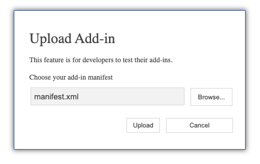
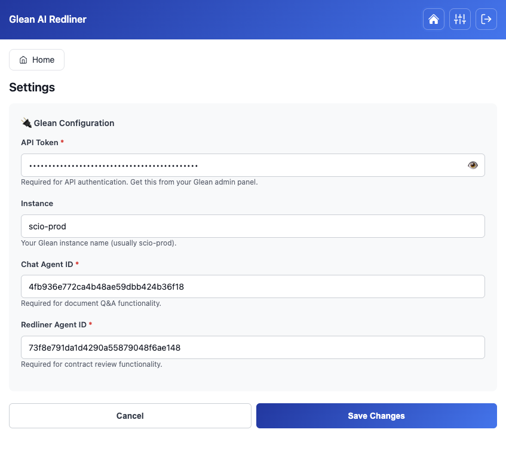

# Glean Legal Contract Review - Word Add-in

AI-powered contract review and analysis for Microsoft Word using Glean's intelligent agents.

---

## Overview

The Glean Legal Contract Review Add-in brings AI-powered contract analysis directly into Microsoft Word. Review contracts with customizable playbooks, get intelligent recommendations, and chat with your documents using Glean's advanced AI agents.


### Key Features

- **📋 Playbook Review**: Analyze contracts using customizable templates and playbooks
- **💬 Chat with Document**: Ask questions about your contract and get AI-powered answers
- **✨ AI Recommendations**: Get intelligent redline suggestions with detailed reasoning
- **🎯 Flexible Analysis**: Review entire documents or selected text
- **📝 Custom Templates & Playbooks**: Provide your own templates/playbooks via URL or text
- **🔄 Track Changes**: All modifications applied with Word's native track changes
- **☁️ Production Ready**: Full AWS serverless infrastructure

---

## Architecture


The Glean Legal Contract Review Add-in integrates Microsoft Office 365 Word with Glean's AI platform through a serverless AWS infrastructure:

- **Frontend**: Office 365 Word Add-in with hosted web elements (HTML/JS/CSS)
- **Authentication**: Dual-mode — Amazon Cognito (username/password) or Glean SSO (OAuth2 PKCE)
- **Admin Config**: DynamoDB-backed org config with admin page for managing settings
- **Infrastructure**: AWS serverless stack (API Gateway, Lambda, S3, CloudFront, CDN)
- **AI Engine**: Glean platform with specialized agents for contract analysis
- **Data Sources**: Enterprise connectors (120+ sources) including Box, GitHub, SharePoint, Google Drive, etc.

---

## Prerequisites

Before you begin, ensure you have:

- **AWS Account** with administrative access
- **AWS CLI** installed and configured
- **Glean Instance** with administrative access
- **Custom Domain Name** that you control
- **Bash/Zsh shell** (macOS/Linux natively; Windows users need WSL or Git Bash)
- **Node.js 16+** (for local development only)

---

## Quick Start Guide

### Part 1: Set Up Glean Agents (~15 minutes)
1. Create 3 agents in your Glean instance using the provided templates
2. Note the Agent IDs for each agent
3. Get your Glean API token (Cognito mode only — SSO handles this automatically)

### Part 2: Deploy AWS Infrastructure (~20 minutes)
1. Create ACM certificate in us-east-1
2. Configure deployment settings in prod.env
3. Deploy CloudFormation stack
4. Configure DNS

### Part 3: Deploy & Install (~10 minutes)
1. Deploy application files to S3 (auto-generates configs)
2. Upload manifest to Word
3. Configure Glean settings in the add-in
4. Test the features

**Total Time: ~45 minutes**

---

## Detailed Deployment Guide

### Step 1: Set Up Glean Agents

You need to create 3 agents in your Glean instance. Templates are provided in `deployment/glean/agents/`.

#### 1.1 Create Chat Agent

1. Log into your Glean instance
2. Navigate to **Agents** → **Create New Agent**
3. Name: `Legal Chat Assistant`
4. Review the template: `deployment/glean/agents/chat-agent-template.json`
5. Configure the agent with prompts for legal Q&A
6. Test with sample contracts
7. **Copy the Agent ID** (format: `xxxxxxxxxxxxxxxxxxxxxxxxxxxxxxxx`)

#### 1.2 Create Redliner Agent

1. Create a new agent in Glean
2. Name: `Contract Redlining Agent`
3. Review the template: `deployment/glean/agents/redliner-agent-template.json`
4. Configure with contract analysis prompts
5. Set output format to XML
6. Define input fields: Contract Text, Template Link, Playbook Link
7. Test with sample contracts
8. **Copy the Agent ID**

#### 1.3 Create Listing Agent

1. Create a new agent in Glean
2. Name: `Template & Playbook Listing Agent`
3. Review the template: `deployment/glean/agents/listing-agent-template.json`
4. Connect to your document sources (Google Drive, SharePoint, etc.)
5. Configure search parameters
6. Test to ensure it returns documents
7. **Copy the Agent ID**

#### 1.4 Get Glean API Token (Cognito mode only)

> **SSO mode**: Skip this step. In SSO mode, the OAuth access token serves as the API token — users authenticate via their organization's SSO and tokens are obtained automatically.

1. In your Glean instance, go to **Settings** → **API**
2. Click **Generate New Token** or use an existing token
3. **Important**: Ensure the token has the following permissions:
   - ✅ **Agents** - Required for calling Glean agents
   - ✅ **Chat** - Required for chat functionality
4. **Copy and save this token** - you'll need it later for the Word Add-in Settings

---

### Step 2: Create AWS Certificate

1. Open AWS Console and navigate to **Certificate Manager**
2. **Important**: Switch to **us-east-1** region (required for CloudFront)
3. Click **Request a certificate**
4. Choose **Request a public certificate**
5. Enter your domain name (e.g., `gleanredlining.yourdomain.com`)
6. Choose validation method (DNS or Email)
7. Complete validation
8. **Copy the Certificate ARN** (format: `arn:aws:acm:us-east-1:...`)

---

### Step 3: Configure Deployment Settings

#### 3.1 Create prod.env file

From the project root:

```bash
cp deployment/config/prod.env.example deployment/config/prod.env
```

#### 3.2 Edit prod.env

Open `deployment/config/prod.env` and fill in your values:

```bash
# AWS Configuration
AWS_PROFILE=your-aws-profile-name
AWS_REGION=us-east-1

# CloudFormation Stack
STACK_NAME=glean-legal-addin
DEPLOYMENT_ID=prod

# Domain and Certificate
DOMAIN_NAME=gleanredlining.yourdomain.com
CERTIFICATE_ARN=arn:aws:acm:us-east-1:123456789:certificate/abc-123-def

# Authentication Mode: "cognito" or "sso"
AUTH_MODE=cognito

# SSO Configuration (only used when AUTH_MODE=sso)
GLEAN_OAUTH_CLIENT_ID=
GLEAN_OAUTH_CLIENT_SECRET=

# Admin Configuration (comma-separated, for initial DynamoDB seeding)
ADMIN_EMAILS=admin@yourdomain.com

# Cognito User (only used when AUTH_MODE=cognito)
COGNITO_USER_EMAIL=admin@yourdomain.com
COGNITO_USER_PASSWORD=YourSecurePassword123!

# Glean Configuration (injected as defaults in the add-in)
GLEAN_INSTANCE=your-instance-name
CHAT_AGENT_ID=your-chat-agent-id
REDLINER_AGENT_ID=your-redliner-agent-id
LISTING_AGENT_ID=your-listing-agent-id
```

#### 3.3 Choose Authentication Mode

The add-in supports two authentication modes:

**Cognito mode** (`AUTH_MODE=cognito`) — Simple username/password:
- Good for demos, POCs, and small teams
- Users sign in with Cognito credentials
- No IT/SSO integration required
- Set `COGNITO_USER_EMAIL` and `COGNITO_USER_PASSWORD`

**SSO mode** (`AUTH_MODE=sso`) — Glean OAuth2 PKCE:
- Recommended for production deployments
- Users sign in via their organization's SSO through Glean
- Requires OAuth client registration in Glean admin console
- See [SSO Setup Guide](#sso-setup-guide) below

**Cognito Password Requirements:**
- Minimum 8 characters
- At least one uppercase letter
- At least one lowercase letter
- At least one number
- At least one special character

---

### Step 4: Deploy AWS Infrastructure

From the project root:

```bash
./deployment/scripts/deploy-infrastructure.sh prod
```

**What happens:**
- Creates S3 bucket for static hosting
- Deploys CloudFront distribution with Lambda@Edge authentication
- Creates Cognito User Pool with your admin user (cognito mode)
- Creates DynamoDB config table with admin emails
- Deploys 3 business Lambda functions (list, analyze, chat)
- Deploys config Lambda and OAuth token proxy Lambda (sso mode)
- Creates API Gateway with endpoints
- Configures WAF for security

**Wait time:** 10-15 minutes

**Note:** The deployment outputs (API Gateway URL, CloudFront domain) will be automatically used by the deployment script in the next step.

---

### Step 5: Configure DNS

Create a CNAME record in your DNS provider (Route53, Cloudflare, etc.):

- **Type**: CNAME
- **Name**: `gleanredlining.yourdomain.com` (your domain)
- **Value**: `d1234567890abc.cloudfront.net` (CloudFront domain from Step 4 output)
- **TTL**: 300

The CloudFront domain is printed at the end of the Step 4 script output and saved to `deployment/.stack-outputs`.

**Wait 5-10 minutes** for DNS propagation.

---

### Step 6: Deploy Application Files

From the project root:

```bash
./deployment/scripts/deploy-app.sh prod
```

**What happens:**
- **Generates `src/config/api.js`** from template using CloudFormation outputs
- **Generates `src/taskpane/login.js`** from template (Cognito IDs in cognito mode, placeholders in SSO mode)
- **Generates `src/taskpane/auth.js`** from template (dual-mode auth middleware)
- **Generates `src/config/glean-defaults.js`** from template with auth mode, Glean instance, and agent IDs
- **Generates `manifest.xml`** from template using your domain, API Gateway URL, and Glean instance
- Syncs files from `src/` to S3
- **Uploads `manifest.xml`** to S3 root for public hosting
- Sets correct content-types and cache headers
- Seeds/syncs DynamoDB config (auth mode, OAuth client ID, admin emails)
- Creates CloudFront invalidation
- Verifies deployment

**Wait time:** 2-3 minutes

**Important:** This script automatically configures your application - no manual editing required!

---

### Step 7: Install in Microsoft Word

There are two ways to install the add-in: **centralized deployment** (recommended for production) or **manual sideloading** (for development/testing).

#### 7.1 Option A: Centralized Deployment (Production)

Deploy the add-in to users via the Microsoft 365 Admin Center. This is the recommended approach for production — IT deploys once, and users get the add-in automatically.

1. Sign in to [admin.microsoft.com](https://admin.microsoft.com) as a Microsoft 365 admin
2. Navigate to **Settings** → **Integrated apps**
3. Click **Upload custom apps**
4. Select **"Provide a URL to the manifest file"**
5. Enter your manifest URL: `https://<your-domain>/manifest.xml`
6. Assign to **specific users or security groups**
7. Click **Deploy**

The manifest URL is persistent — future `deploy-app.sh` runs automatically update it. IT only needs to do this once. Add-ins may take up to 24 hours to appear for newly assigned users.

#### 7.1 Option B: Manual Sideloading (Development)

1. Open Microsoft Word
2. Go to **Insert** → **Get Add-ins**
3. Click **My Add-ins** tab
4. Click **Upload My Add-in**

   

5. Browse to `manifest.xml` in your project folder
6. Click **Upload**

   

#### 7.2 Test the Add-in

1. The add-in should appear in the Word ribbon
2. Click the add-in button to open the task pane
3. You'll be prompted to sign in:

   

   - **Cognito mode**: Enter your `COGNITO_USER_EMAIL` and `COGNITO_USER_PASSWORD` from Step 3
   - **SSO mode**: Click **"Sign in with Glean"** — a dialog opens with your organization's SSO login. After authentication, the dialog closes and you're redirected to the app.
4. After login, you'll see the home screen:

   

---

### Step 8: Configure Settings

> **SSO mode**: Skip directly to Step 8.3 — authentication is handled automatically via OAuth and no API token is needed. All settings are pre-filled from your deployment configuration.

#### 8.1 Open Settings

1. Click the **⚙️ Settings** icon in the top-right corner of the add-in
2. You'll see the Settings screen with Glean Configuration fields
3. **Note:** Instance and Agent IDs are pre-filled from your deployment configuration

#### 8.2 Enter Your API Token (Cognito mode only)



1. **API Token** (Cognito mode only — required for API access)
   - Paste your Glean API token from Step 1.4
   - This token must have **Agents** and **Chat** permissions

2. **Instance** (pre-filled)
   - Already set from `GLEAN_INSTANCE` in your `prod.env`
   - Can be overridden if needed

3. **Chat Agent ID** (pre-filled)
   - Already set from `CHAT_AGENT_ID` in your `prod.env`

4. **Redliner Agent ID** (pre-filled)
   - Already set from `REDLINER_AGENT_ID` in your `prod.env`

5. **Listing Agent ID** (pre-filled)
   - Already set from `LISTING_AGENT_ID` in your `prod.env`

#### 8.3 Save Configuration

1. Click **Save Changes**
2. The settings will be saved to your Word document
3. You're now ready to use the add-in!

#### 8.4 Test the Features

1. **Playbook Review**: Click **Contract Review** on the home screen to open the review setup. Select your scope, template, and playbook, then click **Start Analysis**.

   

   The add-in sends your contract to Glean AI for analysis. This typically takes 3–5 minutes.

   

2. **Chat**: Click **Chat with Contract** to ask questions about your document and get AI-powered answers.

---

## Architecture Details

```
Word Add-in (Frontend)
    ↓
CloudFront CDN + Lambda@Edge Auth
    ↓
S3 Static Hosting
    ↓
API Gateway (AWS)
    ↓
Lambda Functions (3)
├── /list → Template & Playbook Lister Agent
├── /analyze → Contract Redlining Agent  
└── /chat → Legal Chat Assistant Agent
    ↓
Glean AI Platform
```

### Tech Stack

**Frontend:**
- Vanilla JavaScript (ES Modules)
- HTML5 + CSS3
- Office.js API
- Source file deployment (no webpack)

**Backend:**
- AWS Lambda (Python 3.11, Node.js 20.x)
- API Gateway (REST API)
- CloudFront CDN
- Lambda@Edge (Authentication)
- Cognito (User Management — cognito mode) or Glean OAuth SSO (sso mode)
- DynamoDB (Configuration Storage)
- S3 (Static Hosting)
- WAF (Security)

**AI Integration:**
- Glean AI Platform
- 3 Custom Agents
- XML response parsing

---

## Local Development

This project uses source-file deployment (no build step). For local development:

```bash
# Install dependencies (for dev tools only)
npm install

# Generate dev certificates (required for HTTPS)
npm run dev-certs

# Validate your manifest
npm run validate

# Sideload add-in in Word Desktop
npm run sideload
```

**Note:** The project deploys source files directly to S3 — there is no webpack build for production. The `src/` directory is what gets deployed. Generated config files (`api.js`, `login.js`, `auth.js`, `glean-defaults.js`, `manifest.xml`) are created by `deploy-app.sh` and are gitignored.

---

## Updating the Application

### Deploy Frontend Changes

From the project root:

```bash
./deployment/scripts/deploy-app.sh prod
```

Use this when you modify files in `src/`.

### Deploy Infrastructure Changes

From the project root:

```bash
./deployment/scripts/deploy-infrastructure.sh prod
```

Use this when you modify `deployment/cloudformation.yaml`.

**Note:** Infrastructure changes are rare. Most updates only require `deploy-app.sh`.

**API Gateway:** The script automatically redeploys the API Gateway stage after stack updates, ensuring changes to Lambda integrations and timeouts take effect immediately.

### Team Handoff

The `prod.env` file is **gitignored** and not stored in the repository. If a new team member needs to deploy:

1. Copy the example: `cp deployment/config/prod.env.example deployment/config/prod.env`
2. Fill in the values — you'll need:
   - **AWS_PROFILE**: Your configured AWS CLI profile with access to the account
   - **DOMAIN_NAME** and **CERTIFICATE_ARN**: From the original deployment (check Route53/ACM in AWS Console)
   - **AUTH_MODE**: `cognito` or `sso` (check with the original deployer)
   - **Cognito mode**: `COGNITO_USER_EMAIL` / `COGNITO_USER_PASSWORD` (the admin credentials)
   - **SSO mode**: `GLEAN_OAUTH_CLIENT_ID` / `GLEAN_OAUTH_CLIENT_SECRET` (from Glean admin console)
   - **GLEAN_INSTANCE** and **Agent IDs**: From your Glean admin console
3. Infrastructure values (S3 bucket, CloudFront distribution, API Gateway URL) are automatically pulled from CloudFormation outputs — you do **not** need to fill these in.

---

## Troubleshooting

### Add-in doesn't load
- Verify manifest.xml URLs match your domain
- Check CloudFront distribution status (should be "Deployed")
- Check browser console for errors
- Verify DNS is propagated: `nslookup your-domain.example.com`

### Authentication fails
- **Cognito mode**: Verify Cognito credentials are correct
- **SSO mode**: Verify OAuth Client ID is correct and redirect URI matches exactly
- **SSO mode**: Check that required scopes are granted: `agents chat search`
- Check Lambda@Edge logs in CloudWatch (in the region closest to you)
- Ensure password meets requirements (Cognito mode)

### SSO login popup doesn't open
- Ensure pop-ups are not blocked in your browser
- In Word Desktop, the Office Dialog API handles the popup — check Office.js console logs
- Verify `oauth-dialog.html` is accessible at `https://<your-domain>/taskpane/oauth-dialog.html`

### SSO token refresh fails
- Check browser console for `[OAUTH]` log messages
- Verify the required scopes (`agents chat search`) were granted during client registration
- The refresh has a 60-second minimum interval and exponential backoff
- After 5 consecutive failures, the user is prompted to re-authenticate

### API calls fail
- Verify API Gateway URL in `src/config/api.js`
- Check Glean API token in Settings screen
- Review Lambda function logs in CloudWatch
- Verify agent IDs are correct in the Settings screen

### Changes don't apply
- Ensure track changes is enabled in Word
- Check console logs for parsing errors
- Verify XML response format from Glean agent

### CloudFormation deployment fails
- Check you're using us-east-1 region
- Verify ACM certificate exists and is validated
- Check AWS CLI credentials have sufficient permissions
- Review CloudFormation events in AWS Console

---

## SSO Setup Guide

To use SSO mode (`AUTH_MODE=sso`), follow these steps:

### 1. Register OAuth Client in Glean

1. Log into your Glean admin console
2. Navigate to **Settings** → **Third-party access (OAuth)**
3. Click **Register new client**
4. Set **Redirect URI** to: `https://<your-domain>/taskpane/oauth-callback.html`
5. Request scopes: `agents chat search`
6. **Copy the Client ID and Client Secret**

### 2. Configure prod.env

```bash
AUTH_MODE=sso
GLEAN_OAUTH_CLIENT_ID=your-client-id-from-step-1
GLEAN_OAUTH_CLIENT_SECRET=your-client-secret-from-step-1
ADMIN_EMAILS=admin@yourcompany.com
```

### 3. Deploy

```bash
./deployment/scripts/deploy-infrastructure.sh prod
./deployment/scripts/deploy-app.sh prod
```

### 4. Test SSO Login

1. Open the add-in in Word
2. You should see a **"Sign in with Glean"** button instead of email/password
3. Click the button — a dialog opens with your organization's SSO login
4. After successful authentication, the dialog closes and you're redirected to the app

### How SSO Works

1. User clicks "Sign in with Glean" → Office Dialog API opens `oauth-dialog.html`
2. Dialog generates PKCE code verifier/challenge and redirects to Glean's `/api/oauth/authorize`
3. User authenticates via their organization's IdP (Okta, Azure AD, Google, etc.)
4. Glean redirects back to `oauth-callback.html` with an authorization code
5. Callback page exchanges code for tokens via the OAuth token proxy Lambda
6. Tokens stored in localStorage, dialog sends `messageParent` back to taskpane
7. Access token is silently refreshed at 80% TTL using the refresh token

### Token Lifecycle

- **Access token**: Short-lived, used for all Glean API calls
- **Refresh token**: Long-lived, used to silently refresh access tokens
- **Silent refresh**: Runs at 80% of token TTL, no user interaction needed
- **Loop prevention**: Max 1 refresh attempt per 60 seconds, exponential backoff on failures (up to 5 minutes)
- **Re-auth**: If refresh fails after 5 attempts, user is prompted to sign in again via Dialog API

---

## Admin Page

The admin page allows designated administrators to manage organization-wide configuration without redeploying.

### Accessing the Admin Page

1. Log into the add-in
2. If you're an admin (email listed in `ADMIN_EMAILS`), a **shield icon** appears in the header
3. Click the shield icon to open the admin page

### Admin Capabilities

- **Manage admin emails**: Add or remove admin users
- **Configure Glean settings**: Set default instance, agent IDs, and OAuth client ID
- **Organization-wide defaults**: Settings configured here apply to all users as defaults

### Config Resolution (3-tier)

Settings are resolved in this order:
1. **User override** — User's local settings (from Settings screen)
2. **Org config** — Admin-configured defaults (from Admin page)
3. **Baked-in defaults** — Values from `prod.env` at deployment time

### Post-Deployment Changes (No Redeploy Needed)

These can be changed via the admin page:
- Agent IDs (chat, redliner, listing)
- Glean instance name
- OAuth Client ID
- Admin email list

### Changes That Require Redeployment

- Switching auth mode (Cognito ↔ SSO) → Edit `prod.env` + run both deploy scripts
- Changing domain / certificate → Edit `prod.env` + run `deploy-infrastructure.sh`
- Resetting config to prod.env values → Run `deploy-app.sh --force-seed`

---

## Security

- ✅ No hardcoded credentials in repository
- ✅ Dual-mode auth: Cognito JWT or Glean OAuth2 PKCE
- ✅ Lambda@Edge request validation
- ✅ WAF protection with rate limiting
- ✅ HTTPS only (CloudFront + ACM)
- ✅ S3 private buckets with OAC
- ✅ OAuth tokens stored in localStorage with automatic refresh
- ✅ PKCE flow prevents authorization code interception
- ✅ State parameter prevents CSRF attacks
- ✅ Redirect URI validation on token proxy Lambda

---

## Project Structure

```
glean-legal-o365-addin/
├── src/
│   ├── taskpane/              # Main UI components
│   │   ├── login.html/.js     # Dual-mode login (Cognito or SSO)
│   │   ├── auth.js            # Auth middleware (validates tokens)
│   │   ├── taskpane.html      # Main app shell
│   │   ├── app.js             # App logic + SSO lifecycle
│   │   ├── admin.html/.js     # Admin config page
│   │   ├── oauth-dialog.html  # OAuth PKCE flow popup
│   │   ├── oauth-callback.html # OAuth redirect handler
│   │   └── screens.js         # Screen templates
│   ├── services/              # Business logic
│   │   ├── gleanApi.js        # Glean API integration
│   │   ├── gleanOAuth.js      # OAuth PKCE + token lifecycle
│   │   ├── settings.js        # 3-tier config resolution
│   │   └── officeIntegration.js # Word API integration
│   └── config/                # API and default configuration
├── deployment/
│   ├── cloudformation.yaml    # AWS infrastructure (Lambdas, API GW, etc.)
│   ├── scripts/               # Deployment scripts
│   ├── config/                # Environment configuration (prod.env)
│   └── glean/
│       └── agents/            # Agent templates & instructions
└── manifest.xml               # Office Add-in manifest
```

---

## Additional Resources

- [Glean Agent Templates](deployment/glean/README.md) - Detailed agent setup instructions

---

## Support

For issues or questions, please refer to the troubleshooting section above or contact your Glean administrator.
